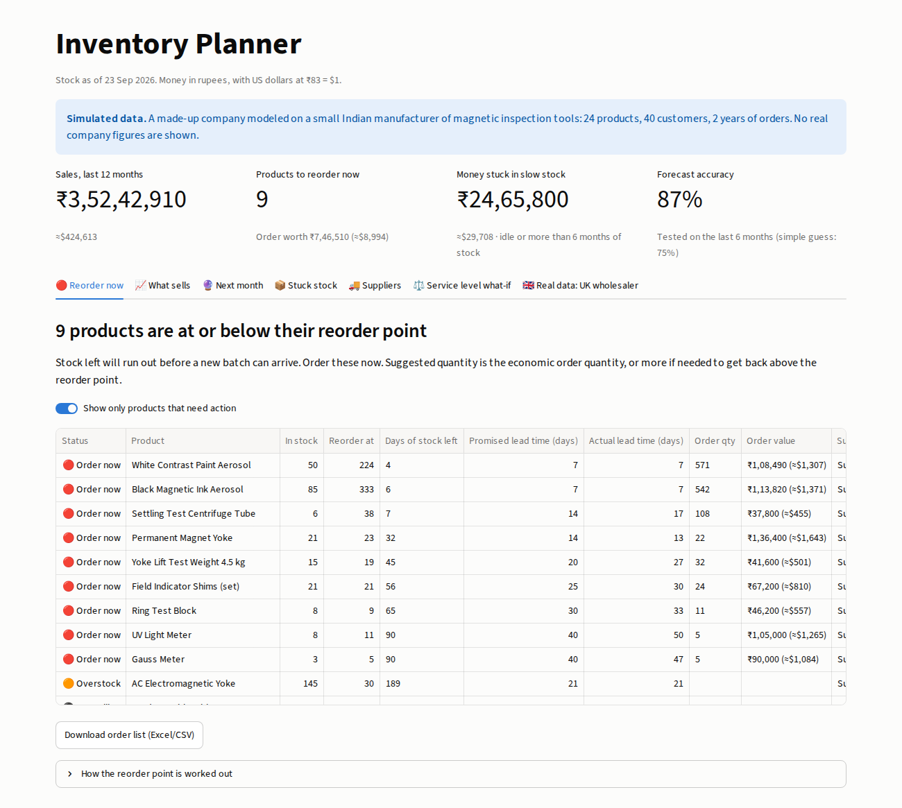
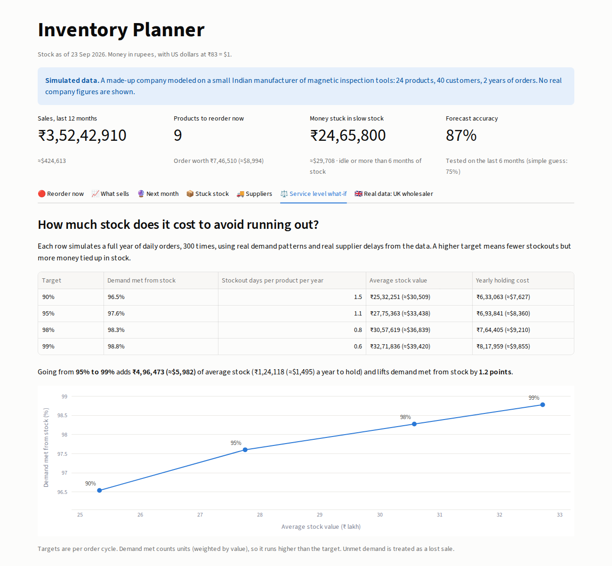
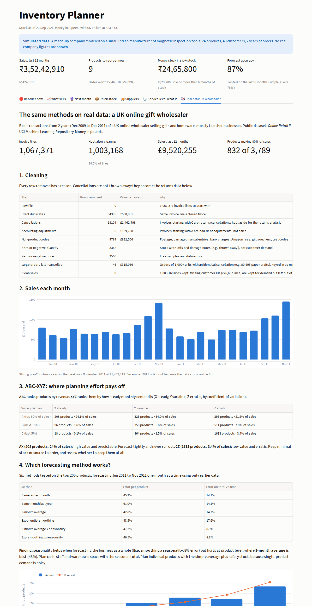

# Inventory Planner

**Live demo:** https://inventory-planner-aniket.streamlit.app

An inventory and demand planning tool built in Python, SQL and Streamlit. It answers the questions an operations or supply chain team asks every week:

1. **What should we reorder now, and how much?** Reorder points with safety stock, and economic order quantities.
2. **Which suppliers can we rely on?** Promised against actual lead times, and on-time delivery rates.
3. **What will we sell next month?** Demand forecasts, backtested against simpler methods.
4. **How much stock is enough?** A simulation of the trade-off between running out and holding stock.
5. **Does it work on real data?** The same methods applied to 1 million real transactions from a UK wholesaler.



## Two datasets

| | Simulated manufacturer | Real wholesaler |
|---|---|---|
| What it is | A made-up Indian maker of magnetic inspection tools | UK online gift wholesaler, *Online Retail II* (UCI Machine Learning Repository) |
| Size | 24 products, 40 customers, 5 suppliers, 2 years | 1,067,371 invoice lines, 5,305 stock codes, 43 countries, 2 years |
| Why | Has stock levels, suppliers and lead times, which public data lacks | Real, messy demand, which tests the cleaning and forecasting |

All numbers for the manufacturer are simulated. None are real company figures.

## Key findings

**Simulated manufacturer**
- 9 products are at or below their reorder point. ₹24.7 lakh (≈$29.7k) sits in idle or overstocked items.
- The instruments importer delivers on time only 36% of the time and averages 8.5 days late, so its products need extra safety stock. Using the *promised* lead time would underestimate how much.
- Raising the service level from 95% to 99% adds ₹5.0 lakh of average stock (₹1.2 lakh a year to hold) for 1.2 points more demand met from stock.
- Stock turns over 3.8 times a year (96 days of inventory). Yokes are the slowest category at 133 days.
- The seasonal forecast is off by 13% over the last 6 months, against 25% for "same as last month".

**Real wholesaler**
- Cleaning removed 64,203 lines (6%) in 7 documented steps, including 34,335 duplicates and 46 huge orders keyed in by mistake and then cancelled.
- 832 of 3,789 products (22%) bring in 80% of revenue.
- ABC-XYZ: 208 products are high value with steady demand (24% of sales) and deserve the tightest planning; 1,613 are low value and erratic (3.4% of sales).
- No single forecast method wins everywhere. Seasonality cuts the error on **total** volume from 14% to 8%, but at the **product** level a plain 3-month average does best (43% against 45% for "same as last month"). Plan cash and capacity with the seasonal total; plan individual products with the simple average plus safety stock.

The full write-up is in [docs/case_study.md](docs/case_study.md).

## Methods

| Topic | Method |
|---|---|
| Safety stock | z × √(LT × σ_d² + d² × σ_LT²), covering both demand swings and late deliveries |
| Reorder point | average daily demand × actual lead time + safety stock |
| Order quantity | EOQ = √(2 × annual demand × order cost ÷ holding cost per unit) |
| Demand variability | weekly totals, because B2B orders are lumpy day to day |
| ABC | SQL window functions on cumulative revenue share (80% / 95%) |
| XYZ | coefficient of variation of monthly demand (≤0.5 steady, ≤1.0 variable, above 1.0 erratic) |
| Forecast | 3-month average, exponential smoothing and seasonal versions, each backtested month by month with no look-ahead (WAPE) |
| What-if simulation | 300 simulated years per service level, with demand and lead times resampled from history |

## How it is built

```
CSV / Excel ──► clean + validate ──► SQLite ──► SQL queries ──► Python analysis ──► Streamlit dashboard
              (src/load_db.py,                  (sql/*.sql)    (src/analysis.py,
               src/real_data.py)                               src/supply.py)
```

```
app.py                       dashboard (7 tabs)
src/config.py                settings: exchange rate, service level, costs, thresholds
src/generate_sample_data.py  builds the simulated company
src/load_db.py               loads and checks the simulated data
src/analysis.py              ABC, idle stock, forecast and backtest
src/supply.py                suppliers, safety stock, EOQ, turnover, service-level simulation
src/real_data.py             downloads, cleans and analyses the real dataset
sql/                         schema and all analysis queries
tests/                       checks for the formulas and cleaning steps
docs/                        case study and screenshots
```

## Run it

```
pip install -r requirements.txt
python src/load_db.py            # simulated company (a few seconds)
python src/real_data.py          # real dataset: downloads 45 MB, takes 2 to 3 minutes
python -m streamlit run app.py
python -m pytest -q              # 7 tests
```




## Data source

Chen, D. (2019). *Online Retail II* [Dataset]. UCI Machine Learning Repository. https://doi.org/10.24432/C5CG6D (CC BY 4.0)

## Tech

Python · pandas · NumPy · SciPy · SQL (SQLite) · Streamlit · Plotly · pytest · Git
